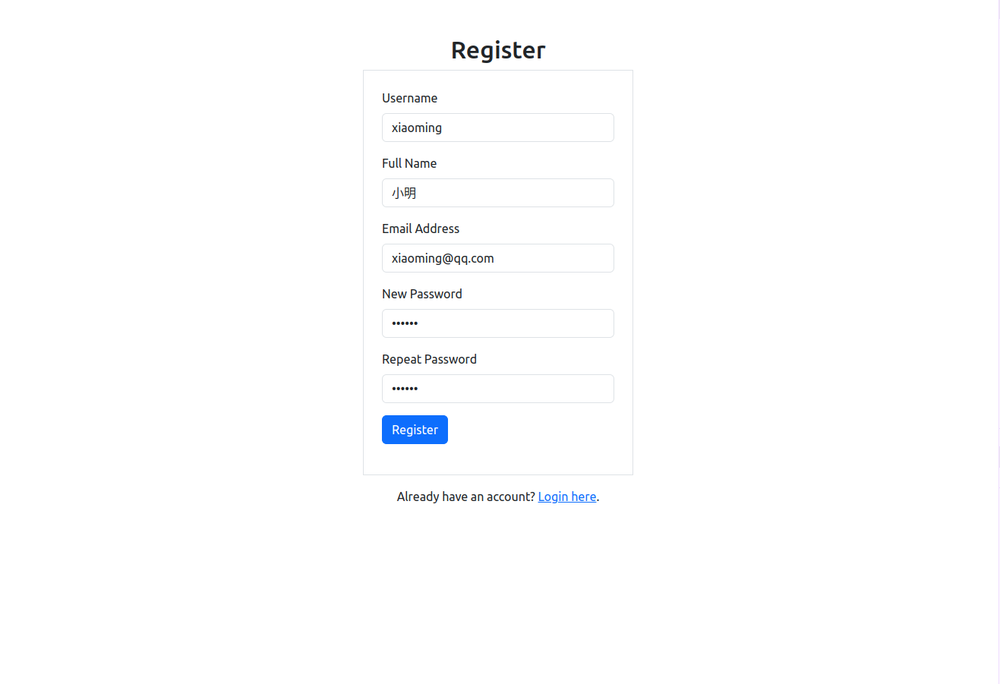
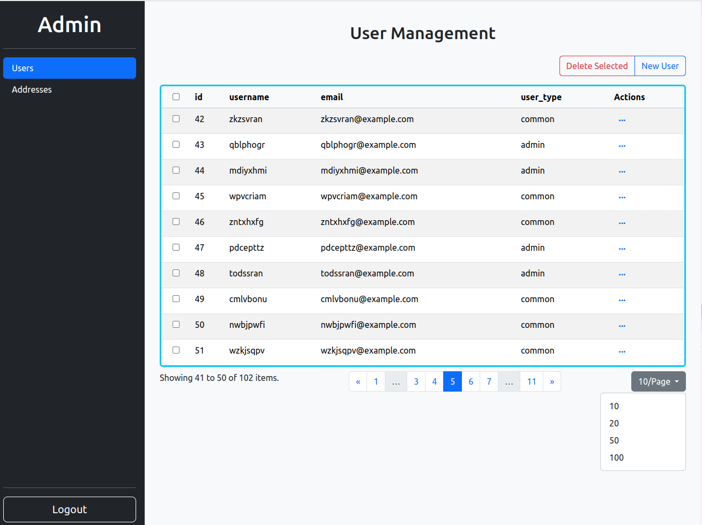
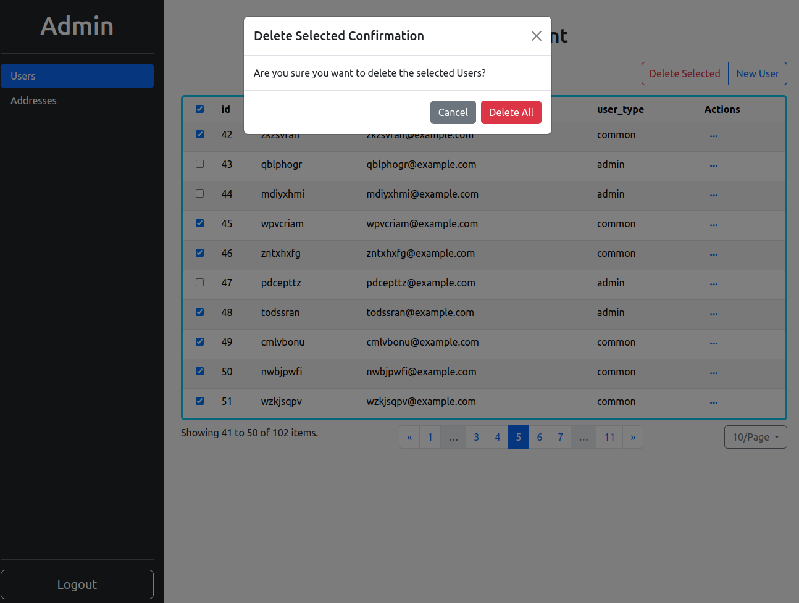
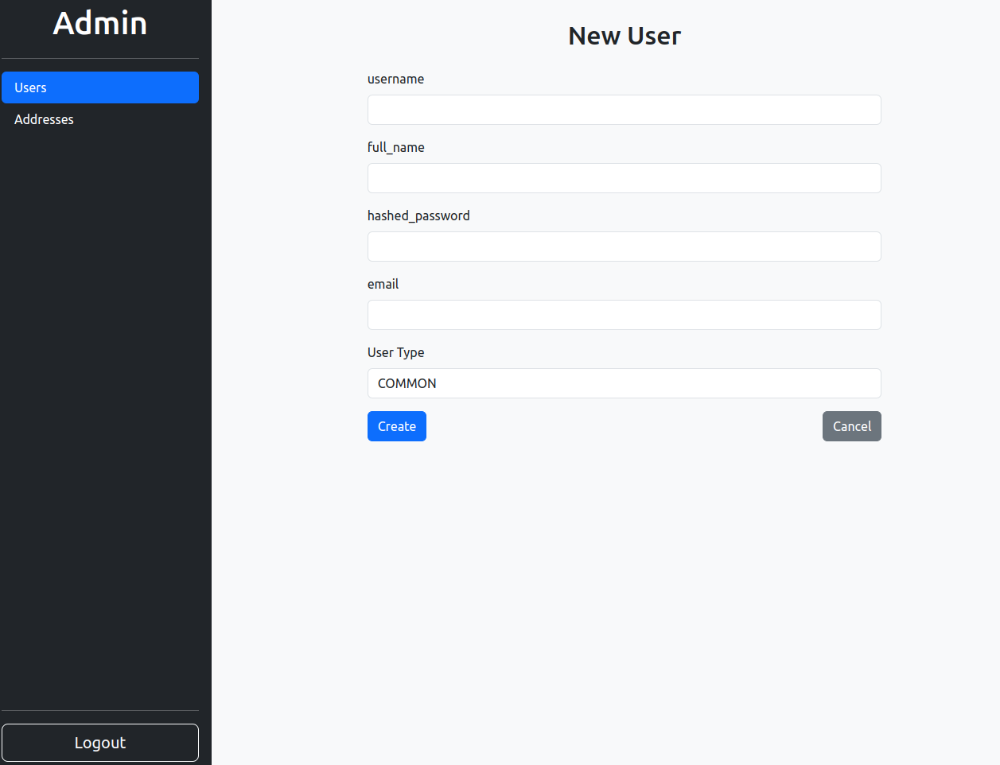
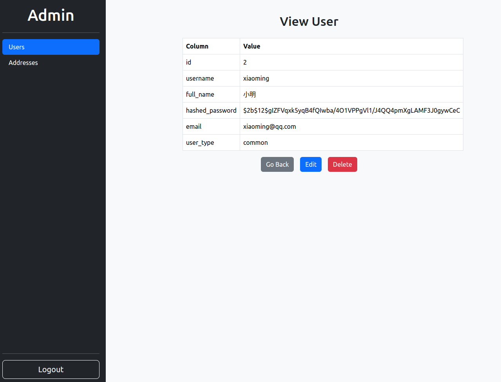
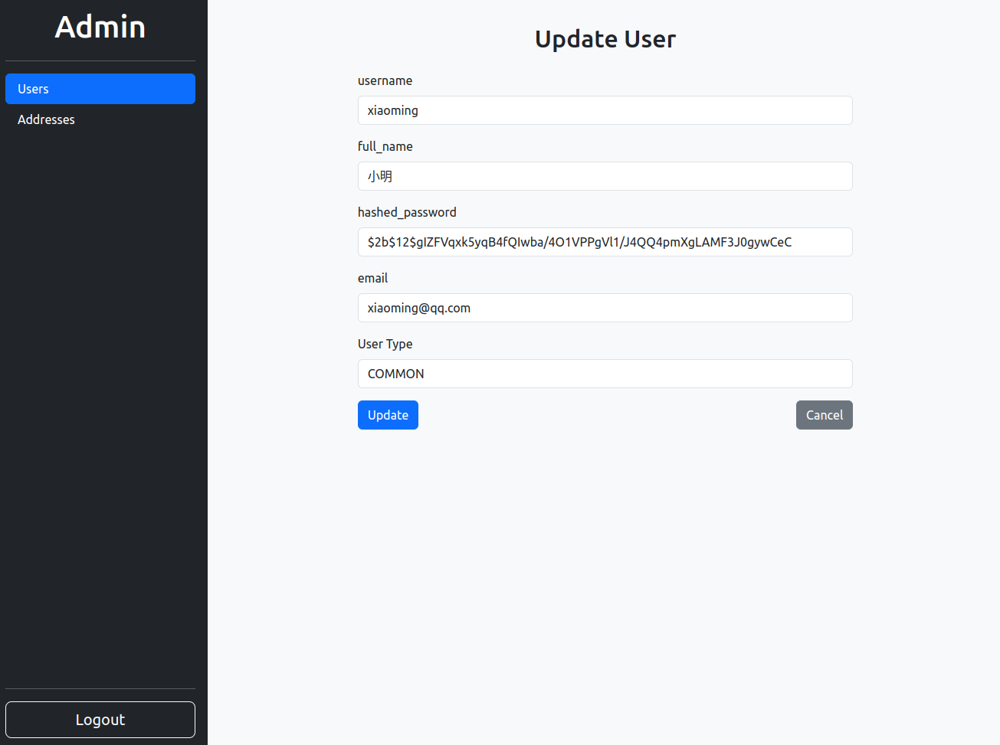

# Full Stack FastAPI Template

This template offers a simplified admin interface, drawing inspiration from [SQLAdmin](https://github.com/aminalaee/sqladmin). It features an async SQLAlchemy engine and WTForms for form building and validation. Unlike SQLAdmin, which uses metaprogramming and Starlette, this template simplifies the process with straightforward function calls for adding model views and utilizes FastAPI directly. Relationship view and selection, search, and export features are not supported.


## Technology Stack

- Backend: FastAPI + SQLAlchemy + Jinja2
- Database: PostgreSQL
- Frontend: Bootstrap


## Usage

To get started with this template:

1. **Create a new repository using this template**:

   - Click the "Use this template" button to create a new repository under your GitHub account.
   - Clone your newly created repository:

   ```bash
   git clone git@github.com:<your-username>/<your-repository>.git
   cd <your-repository>
   ``````

2. **Create a virtual environment**:

   ```bash
   python -m venv venv
   source venv/bin/activate 
   ```

3. **Install dependencies**:

   ```bash
   pip install -r requirements.txt
   ```

4. **Configure environment variables**:

   Modify the `.env` file with your specific settings, or set the necessary environment variables directly in your shell. This includes your database URL, secret keys, etc.

5. **Run the application**:

   With your environment configured, you can now start the application.

   ```bash
   uvicorn app.main:app --reload
   ```

   The application should now be running and accessible at `http://127.0.0.1:8000`.


## Screenshots














## Reference

- https://github.com/tiangolo/full-stack-fastapi-template
- https://github.com/aminalaee/sqladmin

